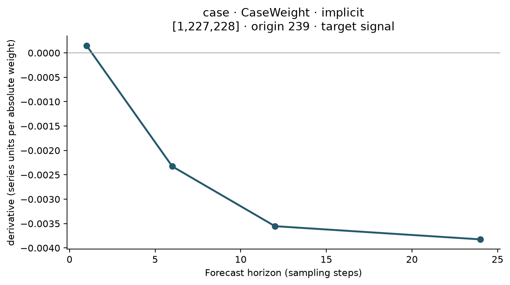

# ForecastInfluence

Observation-influence studies for forecasting, with explicit interventions,
horizon-resolved results, and numerical reference checks.

**Version 1.0.0, plus unreleased additions** (see [CHANGELOG](CHANGELOG.md)).
A local, typed research package by **Malek Itani**, licensed
under MIT for anyone to use. Verified with **477 passing tests and 96.39% coverage**,
including the complete tests and 13 examples against a clean installed wheel.
Source code is available at [github.com/Ma-Mar-Itan/ForecastInfluence](https://github.com/Ma-Mar-Itan/ForecastInfluence).
No PyPI package upload or hosted documentation site is claimed. See the
[v1 handoff](docs/project/handoff_v100.md) and [release checklist](docs/project/release_checklist_v100.md).

## What it answers

- Which training cases most change a particular forecast horizon or path?
- What changes when a recorded value is corrected, including its later uses as a lag?
- How closely does a local approximation agree with numerical refitting?

These questions require a declared unit, intervention, target and replay policy.
The package keeps those choices in each result, alongside source membership,
model specifications, numerical diagnostics and labeled output dimensions. It
does not automatically identify bad data: a large effect can reflect useful
information, a regime change, a measurement problem, or an unstable fitted model.

## Install from this checkout

```bash
python -m pip install -e .
```

For sparse/Huber models add `python -m pip install -e ".[models]"`; for plotting
add `python -m pip install -e ".[plots]"`. Base imports require
NumPy, pandas and xarray; Matplotlib is loaded only when plotting is requested.
No model download, service account or network dataset is needed by the examples.
The declared Python minimum is 3.11. The full suite has been executed on Python
3.12 on Windows and on Python 3.11, 3.12 and 3.13 on Linux, including under a
different NumPy minor version. The checked-in CI matrix also covers Windows and
macOS runners, but its presence is not evidence of completed remote runs.

## A complete study

This deterministic AR(1) example fits a ridge model with two lag features and
recursively forecasts horizons 1, 3 and 6. Each of the final three training cases
is a separate intervention. The local result differentiates an absolute case
weight at one; the finite result sets that weight to zero and refits with the
original denominator. The explicit conversion makes their units comparable.

<!-- BEGIN QUICKSTART -->
```python
import numpy as np
import pandas as pd

from forecastinfluence import (
    CaseWeight,
    InfluenceStudy,
    LagFeatures,
    RecursiveForecaster,
    RidgeRegressor,
    SetCaseWeight,
    compare,
)

rng = np.random.default_rng(42)
values = np.zeros(80)
for t in range(1, len(values)):
    values[t] = 0.7 * values[t - 1] + rng.normal(scale=0.4)
y = pd.Series(values, name="signal")

study = InfluenceStudy(
    forecaster=RecursiveForecaster(RidgeRegressor(penalty=0.1), LagFeatures([1, 2])),
    horizons=[1, 3, 6],
).fit(y=y)
sources = study.sources(unit="case").last(3)
local = study.local(sources=sources, wrt=CaseWeight())
deletion = study.effect(sources=sources, change=SetCaseWeight(0))
approximation = local.first_order(change=SetCaseWeight(0))

print(study.forecast())
print(deletion.rank(horizon=3)[["source", "effect", "status"]])
print(compare(approximation, deletion)[["horizon", "absolute_error"]])
assert local.effect.dims == ("source", "origin", "horizon", "target")
assert np.isfinite(deletion.effect.values).all()
```
<!-- END QUICKSTART -->

This block is synchronized with [examples/quickstart.py](examples/quickstart.py).
The baseline forecast at horizon 3 is approximately `0.047816`. For this seed,
deleting the last case lowers it by approximately `0.004374`. These are synthetic
demonstration values, not expected behavior for another dataset. A ranking keeps
the signed effect and status while sorting by magnitude by default. Specify
every varying non-source axis before ranking; use an explicit reduction when
you intend to combine horizons or origins.



*Native ridge (`penalty=0.05`, lags 1, 2 and 24) recursive forecasts on synthetic
data with seed 7. The figure shows one case's local weight derivative, in forecast
series units per absolute case-weight unit.
Regenerate it with `python scripts/generate_example_assets.py`.*

## Supported computations

The executable capability declarations generate this table. All rows below are
implemented scalar capabilities. Implicit derivatives apply to native OLS/ridge;
LASSO, elastic net, Huber and replay pipelines use numerical methods. The standard
scalar targets are the
forecast-value, supplied squared-error and parameter-value targets.

<!-- BEGIN CAPABILITIES -->
| Source unit | Quantity | Engine |
|---|---|---|
| case | Local derivative | `implicit` |
| case | Local derivative | `central_difference` |
| observation | Local derivative | `central_difference` |
| case | Finite after-minus-before effect | `refit` |
| observation | Finite after-minus-before effect | `refit` |
<!-- END CAPABILITIES -->

Typed groups apply their member changes simultaneously. Raw edits rebuild all
training occurrences and, by default, the forecast context. Rolling studies use
explicit origins and exact raw observation windows. Results retain separate
source, origin, horizon and target axes; coefficient results use model and
parameter axes instead. Results can be exported as JSON plus numeric NPZ without
pickling models or embedding the original raw series.

Additional implemented workflows:

- **Exogenous designs:** target lags plus declared lagged columns of other recorded
  series, aligned by label, with per-series provenance so an edit to one series never
  disturbs another sharing its timestamp. Direct strategies only.
- **Declared baseline weights:** unit weights, or a rule such as normalized exponential
  decay. Derivatives are taken at the declared baseline and every replay reapplies the
  rule; ad-hoc weight arrays still refuse influence.
- **Sparse and robust models:** LASSO, elastic net and fixed-scale Huber; explicit
  objective normalization, solver diagnostics, selected features and support paths.
- **Deletion and roles:** physical case removal versus raw exclusion with a declared
  missingness policy; additive local response/lag/context derivative paths.
- **Pipeline replay:** frozen or recomputed standard/robust feature scaling and
  deterministic chronological regularization grids, with candidate-switch records.
- **Vector forecasts:** direct/recursive VAR and rolling multivariate studies retain
  source, origin, horizon and target labels; joint case weights and raw-cell edits.
- **Uncertainty:** explicitly conditional Gaussian innovation plug-in interval
  components and their numerical influence. Parameter uncertainty is excluded.
- **Research:** paired synthetic contamination, A–G experiments, matched magnitude
  and rank diagnostics, anomaly-score alignment, group interactions and timed grids.

Read the [v1 API](docs/reference/v100.md), [migration guide](docs/project/migration_v010_to_v100.md),
[sparse guide](docs/guides/sparse_models.md), and [pipeline guide](docs/guides/pipeline_replay.md).
Neural/quantile models, ARIMA/state-space adapters, exogenous inputs, smooth sparse
implicit derivatives and dependence-robust interval calibration are deferred.
Retuning after physical row deletion is rejected until frozen fold identities are
supported; zero weights or fixed tuning remain available. Interval assumptions and
other boundaries are explicit in the [status page](docs/project/status.md).

## Interpret an effect precisely

Finite effects always mean **after minus before**. Positive forecast effect means
the intervention raised the forecast. Positive `SquaredError` effect means it
increased the full squared error against the separately supplied, fixed truth.
The training objective instead uses half squared error. A positive upweighting
derivative has a different intervention direction from deletion.

The intercept-only example `[1, 2, 4]` makes the distinction concrete. Its mean is
`7/3`; the final case's upweighting derivative is `5/9`. Deleting that case changes
the mean by `-5/6`, while its first-order prediction is `-5/9`. A derivative is a
local slope, not an exact finite-deletion formula. Validate local derivatives
with small central differences, then assess finite approximations separately.

A recorded value may appear as a response, in several later lagged predictors,
and in the forecast context. Editing it is therefore a different experiment from
zeroing one fitting case's weight. Case reweighting preserves the original raw
history. Neither experiment establishes a causal effect, a statistical confidence
interval, or a universally harmful observation.

OLS refuses numerically nonunique fits; ridge leaves its intercept unpenalized.
Both retain the baseline loss denominator and expose conditioning and residual
diagnostics. There is no hidden damping or pseudoinverse rescue. Small-step
agreement does not guarantee accurate large deletions, and near-unstable recursive
models can amplify perturbations. Missing and failed entries carry NaN and status
labels; verified dependency exclusions can be structural zeros.

See [statistical meaning](docs/explanations/statistical-contract.md),
[temporal dependencies](docs/explanations/temporal-and-numerical.md), and
[practical workflows](docs/tutorials/interventions.md) for the full conventions.

## Documentation and development

Start with the [documentation home](docs/index.md),
[executable gallery](docs/examples/gallery.md), or
[API reference](docs/reference/api.md). There is no published documentation URL.
From the checkout:

```bash
python -m pip install -e ".[dev,docs,plots,models]"
python scripts/check_readme_examples.py --run
python -m pytest
python -m mkdocs build --strict
python scripts/check_release.py
```

The full release check includes formatting, linting, typing, tests, coverage,
strict documentation, distribution validation and the complete test suite and examples against a clean installed wheel
outside the source tree. The [contributor guide](docs/contributing/development.md)
explains the module boundaries, numerical-oracle expectations and adapter contract.

Influence functions, prediction attribution, group-effect analysis and temporal
attribution have substantial prior work. The [source-grounded comparison](docs/research/related-work.md)
includes Koh and Liang, TimeInf, case-weight LASSO paths, pyDVL and Captum. This
implementation combines explicit forecasting contracts and reference checks; it
does not claim that the underlying differentiation is new. See the
[claims register](docs/research/novelty-claims.md) before making research claims.
Author: **Malek Itani**. The library is available under the [MIT License](LICENSE).
See [CITATION.cff](CITATION.cff) for software citation metadata. No DOI or public
package release is claimed.
